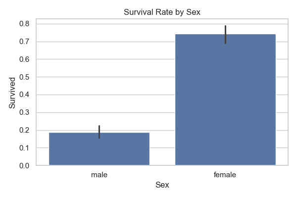
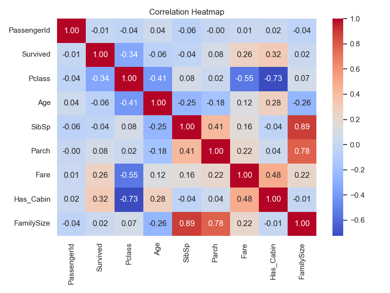

# Titanic Missing Values Handling

   Exploratory data analysis on the Titanic dataset with a focus on 
   handling missing values using Pandas and Scikit-learn.

   ## What this project does
   - Explores demographics, fares, and family relations of passengers
   - Detects and visualizes missing data (Age, Cabin, Embarked)
   - Handles missing values:
     - Age → median imputation grouped by class & gender
     - Embarked → mode imputation
     - Cabin → converted to a binary `Has_Cabin` feature
   - Visualizes survival rates by sex, class, and other factors

   ## Tools used
   Python, Pandas, NumPy, Matplotlib, Seaborn, Scikit-learn

   ## Sample outputs
   
   

   ## How to run
```bash
   pip install pandas numpy matplotlib seaborn scikit-learn
   python titanic_analysis.py
```
